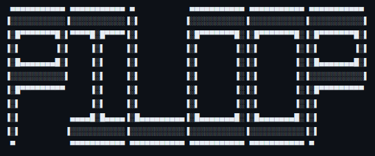
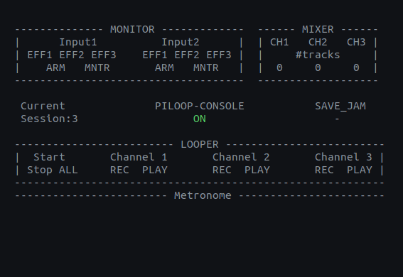

<h1 align="center">
  <a href="https://github.com/pasquale90/pi-loop-console/"></a>
  <h4 align="center">A linux based audio looper written in C++</a>.</h4>
</h1>  

<div align="center">

[](https://github.com/pasquale90/pi-loop-console/tree/licence)
[-green)](https://github.com/pasquale90/pi-loop-console)
[](https://www.youtube.com/watch?v=y8mJdEyd31Y&ab_channel=PasxalisMelissas)
[](https://matrix.to/#/#pi-loop:gitter.im)
</div>

<div align="center">
  <a href="#description">Description</a> |
  <a href="#features">Features</a> |
  <a href="#documentation">Documentation</a> |
  <a href="#installation">Installation</a> |
  <a href="#usage">Usage</a> |
  <a href="#future_work">Future_Work</a> |
  <a href="#feedback">Feedback</a> |
  <a href="#related">Related</a>
</div>

<h1 align="center">
  <a href="https://github.com/pasquale90/pi-loop-console/"></a></h4>
</h1>  

## Description
Pi-loop is a real-time audio looper application that enables users to create interactive musical sessions. One may use an external audio interface to connect a microphone and an instrument or to use the integrated sound card to test it. <br><br>
This repo consists of 2 different **modes** that make use of alternative user interfaces to interact with the software:
- **PC mode** (version 0.9) <br>
  This version runs directly on a Linux machine and allows the usage of **computer components** such as the **keyboard *to trigger events*** and the **screen *to access the output state of the program***.
- **RPI mode** (will be included in the next update) <br>
  This version runs on a <a href="https://www.raspberrypi.com/" target="_blank">**Raspberry Pi**</a> and uses **GPIO**-based connected buttons and rotaries to enable user interaction with the program, and LEDs to access the output state of the program. This mode is currently under development.

*Both modes lie on the same codebase and can be configured on build. More information can be found in the [installation section](#installation) below.*
  
## Features

**Key features** that make Piloop unique:

* **Input signal handling flexibility**
  
  Individual ARM and Monitor (IN/OUT) states for each input channel allow users to choose on the fly which input channels will be streamed on the speakers and which will contribute to the creation of the current loop.

* **Jam saving feature**
  
  Once decided, users can save their overall musical session as a wave file, by pressing a single button. Therefore, not only the loop stream is saved but the combined audio signal stream that has been streamed on the speakers during the session. This can be quite handy for musicians who want to save a session and use it to keep track of their inspirational dynamics or alternatively to use the saved file as a songwriting guide that can be further manipulated in a DAW afterward.

* **Individual effects on each input channel**
  
  This increases the flexibility to add effects individually on each input channel.
  
**Common features** supported:

* 2 input channels\* <br>
* 1 stereo output channel\*<br>
* 3 fully operational loop channels (read further in the [manual page](files/info/manual.md) )<br>
* metronome
  - tap tempo
  - alter tempo
* a menu feature to load, change, and save session presets.<br>

*\*depends on the number of IO channels supported by the audio interface used.*<br>

## Documentation

Documentation is uploaded as a [pdf](files/doc/piloop.pdf) form. 

To use an `html` version, install and run doxygen to generate the documentation files.
```
cd pi-loop-console
doxygen Doxyfile
```
The documentation files will be stored within the `files/docs/html` directory. Open the `files/docs/html/index.html` in a browser window to overview it.

**If you are also interested in the code design, check the [UML file](files/uml/).*

## Installation
Follow this [link](files/info/install.md) to access information on *configuring*, *building*, *running*, and *using* PiLoop in **PC mode**.

For the **RPI mode**, behold for the upcoming updates. You may follow this [link](files/info/rpi-setup.md) to obtain an overview on the connections made to the GPIO pins.

## Usage

To run Piloop, you have to run with sudo priviledge:

```
$ sudo ./piloop
```

To see how to use it visit the [manual page](files/info/manual.md)

## Future_Work

The future work listing is summarized as follows:
* Fix found bugs.
* Improve existing features
* Add new features
* conclude Raspeberry Pi setup
- The name of this application is Piloop and not without reason. The upcoming Piloop-1.0 is to run on a headless Raspberry Pi. Details about the current setup can be found [here](files/info/rpi-setup.md).

Visit the [future-work list](files/info/future_work.md) to get informed about what's next.

## Feedback

If you have used this application and would like to contribute or share your feedback and recommendations on improvements, or if there is anything you would like to say about it by any means, please don't hesitate to share it on [`Gitter`](https://matrix.to/#/#pi-loop:gitter.im) or contact me at <melissaspaschalis@gmail.com>.

## Related
If you liked this project, you may also like:
- [Raspberry-Pi-Looper-synth-drum-thing](https://github.com/otem/Raspberry-Pi-Looper-synth-drum-thing)
- [making-a-looper-with-pure-data/](https://guitarextended.wordpress.com/2013/08/05/making-a-looper-with-pure-data/)
- [iav](https://github.com/pasquale90/interactive-audio-visualizer) : An interactive audio visualizer 

---

<h4 align="center">

:drum: 
:desktop_computer: 
:guitar: 
:trumpet: 
:banjo: 
:violin: 
:musical_keyboard: 
:accordion:
:saxophone:
:headphones:
:musical_note: 
:notes: 
:smiley: 
Enjoy Piloop
:smiley: 
:notes:
:musical_note:
:headphones:
:saxophone:
:accordion:
:musical_keyboard:
:violin:
:banjo:
:trumpet:
:guitar:
:desktop_computer:
:drum: </h4> 


---
