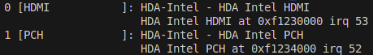
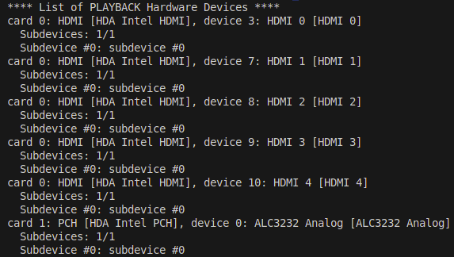
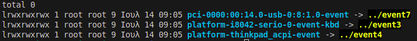

<!-- <h1 align="left">
  <a href="https://github.com/pasquale90/pi-loop-console/"></a>
</h1>   -->

# Instructions section
<h4>You may follow the instructions below to configure, build and run the application.</h4>

## Table of contents

- [Prerequisites](#prerequisites)
- [Configure](#configure)
  - [MODE](#1set-the-mode-to-run-piloop)
  - [AUDIO_INTERFACE](#2configure-the-audio-card)
  - [AUDIO SETTINGS](#3set-sample-rate-and-buffer-size)
- [Build](#build)
- [Run](#run)
- [Help](#help)
  - [Install jack from source](#installing-jack-from-source-files)
  - [install libjsoncpp](#installing-libjsoncpp)
  - [install AudioFile](#installing-audiofile)
  - [install libevdev](#installing-libevdev )
  - [install wiringPi](#installing-wiringpi)
  - [detect audio card](#detecting-the-audio-card)
  - [audio settings](#audio-settings)
  - [setting the keyboard device manually](#setting-the-keyboard-device-manually-pc-mode-only)
  - [setting the i2c bus address manually](#setting-the-i2c-bus-address-manually-rpi-mode-only)


## Prerequisites

The things you need before building the software:

- [jack audio](https://github.com/jackaudio/jack2)
  - To install jack audio you must build it from source with `pkg-config`, `alsa` and `libsamplerate`. For further guidance, visit the [help section](#help).
- [jsoncpp](https://github.com/adamstark/AudioFile)
- [AudioFile](https://github.com/adamstark/AudioFile)
- [libevdev](https://www.freedesktop.org/wiki/Software/libevdev/) (**PC mode only**)
- [wiringPi](https://github.com/WiringPi/WiringPi) (**RPI mode only**)

## Configure

Before configuring the application, you **must** edit the [PILOOP_SETTINGS](../../PILOOP_SETTINGS) file to set various parameters depending on your OS system or hardware setup. To do that, follow the configuration steps listed below:

### 1.set the mode to run PiLoop

Set the variable `MODE` to `PC` if you want to use your computer components (such as the computer keyboard and the computer's screen) or `RPI` if you are on a Raspberry Pi (with buttons and LEDs connected to the GPIO pins).

### 2.configure the audio card

Similarly, set the variable `AUDIO_INTERFACE` with the corresponding name of your sound card. For more information, see the help section([detecting the audio card](#detecting-the-audio-card)).

### 3.set sample rate and buffer size

Replace the value of `SAMPLE_RATE` with a value supported by your audio device, and set the `BUFFER_SIZE`.

Finally, to configure PiLoop, type in terminal:

```
bash scripts/configure.sh
``` 

For more information, visit the help section ([audio settings](#audio-settings) / [Setting the keyboard device manually](#setting-the-keyboard-device-manually-pc-mode-only)).

## Build

To build the application, use the bash scripts provided within the [scripts](../../scripts/) directory.
To do so, type `bash scripts/build.sh`. The resulting binary will be found in the root directory of the local repository.

## Run
After having built the application, you will find `piloop` binary file within `pi-loop-console` directory (*the root of the local repository*). Run `piloop` with **sudo** privileges:

```
cd pi-loop-console
sudo ./piloop
```

## Help

#### Installing jack from source files
To install jack audio you must [build it from source](https://jackaudio.org/faq/build_info.html) with `pkg-config`, `alsa` and `libsamplerate` enabled and `D-Bus` should be preferably disabled. Additionally, `GNU compiler` and `Python` must also be installed on your system.

For example, on a Debian-based system, proceed as follows:

```install jack prerequisites
sudo apt update && sudo apt-get update 

## install g++
apt update && apt -y install build-essential

## install python
sudo apt-get install python3
ln -s /usr/bin/python3 /usr/bin/python

## install pkg-config
sudo apt -y install pkg-config

## install libsamplerate
sudo apt-get install -y libsamplerate0 libsamplerate0-dev

## install alsa driver 
sudo apt-get -y install alsa-utils libasound2-dev libasound2-data

## download jack repository - https://github.com/jackaudio/jack2
git clone https://github.com/jackaudio/jack2.git

cd jack2

# configure jack with pkg-config, alsa and libsamplerate enabled
./waf configure --prefix /usr

# before proceeding, 
# check the configuration output to ensure that jack is configured properly as explained above.
# otherwise, find the missing libraries and install them before reconfiguring.

# build jack
./waf

# install jack on your system
sudo ./waf install
```

Now, you must also configure your Linux system to allow jack to use realtime scheduling. As for that, you may always advice the [relevant guide](https://jackaudio.org/faq/linux_rt_config.html) from the official website, where the whole procedure is summarized in 3 steps.<br>

1) adding the lines:
```
@audio   -  rtprio     95
@audio   -  memlock    unlimited
```
... in the `/etc/security/limits.conf` or the `/etc/security/limits.d/audio.conf` (depending on whether `/etc/security/limits.d` exists on your system) <br>

2) creating an `audio` group and adding your user-id to the group:
```
groupadd audio
usermod -a -G audio yourUserID
usermod -a -G theGroupName yourUserId
```
3) Log-out and log-in.

#### Installing `libjsoncpp`

Use the package manager to install **jsoncpp** library along with the development files. Otherwise build it [from source](https://github.com/open-source-parsers/jsoncpp).

#### Installing [`AudioFile`](https://github.com/adamstark/AudioFile)

No need to install. AudioFile header is already included within the [external](../../external) directory.

#### Installing `libevdev` 

Install `libevdev` to use PiLoop in the `PC mode`, and to use the pc-keyboard. Use the package manager to install **libevdev** library along with the development packages.

#### Installing `wiringPi` 
Install `wiringPi` library along with the development files only if you want to run PiLoop using the **GPIO-based interface** (in **RPI** mode). To install, visit the [wiringpi repository](https://github.com/WiringPi/WiringPi) and follow the installation instructions.

**IMPORTANT** : To use PiLoop in `RPI mode`, you must complete the Raspberry Pi setup to connect the buttons, the potentiometers and the LEDs to the GPIO headers of the rpi device. TO do this, follow the instructions provided in the [Raspberry Pi setup guide](rpi-setup.md).

#### Detecting the audio card

To list the available audio cards installed on your hardware setup, there are two ways listed. 
The first one is to type `cat /proc/asound/cards` on the terminal.<br>

Sample output:
<h3 align="left"></h3>

Alternatively, type `aplay -l` on your terminal, to use the alsa-tools.<br>

Sample output:
<h3 align="left"></h3>

Use a value from the listing devices to set the `AUDIO_INTERFACE` variable in `PILOOP_SETTINGS` (i.e. set `PCH` to configure the system's internal audio device).


#### Audio settings

To make sure that the value of the sampling rate is supported by the audio card, you can run `cat /proc/asound/card<card_id>/codec#0`. Otherwise, the value of `44100` is the most common, and it is broadly supported, so you can leave it as it is.

To set buffer size, use values in the **power of 2**, such as 64, 128, 256, 512, 1024, and so on.
Note that setting the value too low, will reduce latency but will increase CPU overload and may result in audio-related artifacts. To find the optimal value for your hardware, prefer setting `BUFFER_SIZE` with a higher value, such as `1024` or `512`, and reduce it by a factor of 2 in case you encounter audio latency issues, until you find an optimal value for your system. 

#### Setting the keyboard device manually (**PC mode only**)

To set the keyboard device manually, type in terminal `ls -l /dev/input/by-path`.

Sample output:
<h3 align="left"></h3>

In this example, the output states that the keyboard corresponds to `event3`.
Uncomment the line `KEYBOARD_DEVICE=/dev/input/event0` and replace the value of `event0` with the value of `event3`.

#### Setting the i2c bus address manually (**RPI mode only**)

To set the I2C bus address manually, after having install `i2c-tools` on your system,type in terminal `i2cdetect -y 1` to find the bus address.

##

**Check the [manual page](manual.md) to learn how to use PiLoop**