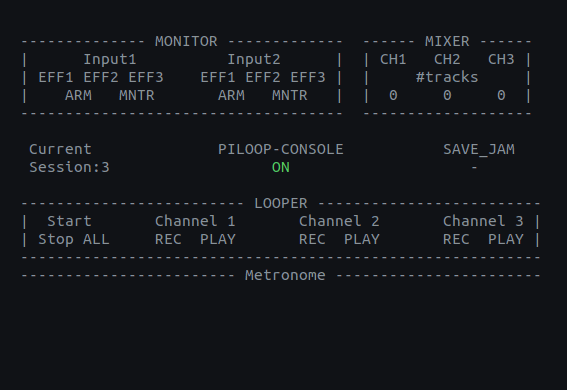

# Manual

#### Here you may find instructions on how to use PiLoop.

## Contents 

- [Interaction controls](#interaction-controls)
  - [RPI mode](#rpi-mode)
  - [PC mode](#pc-mode)
- [Display interface](#display-interface)
- [Action list](#action-list)

## Interaction controls

### RPI mode

The following picture depicts the available controls to operate PiLoop in **RPI mode** (consider it as a resource that demonstrates the naming of the buttons aligned with their spatial layout, rather than an actual circuit). A detailed explanation of the available actions can be found in the [action list](#action-list) section.

  
  <figcaption>Control interface in RPI mode</figcaption>

### PC mode

The list of keyboard controls to operate PiLoop in **PC mode**. A detailed explanation of the available actions can be found in the [action list](#action-list) section.

Control | Action on prolonged pressing | Action on instant pressing
:--- | :---: | ---:
z |	undub last track of channel 1 | record/dub on channel 1
x | erase all tracks of channel 1 | stop playback/recording on channel 1 
c | undub last track of channel 2 | record/dub on channel 2
v | erase all tracks of channel 2 | stop playback/recording on channel 2
b | undub last track of channel 3 | record/dub on channel 3
n | erase all tracks of channel 3 | stop playback/recording on channel 3
a | erase all tracks from all channels | pause/unpause all tracks from all channels
s | save jam | - 
q | - | Enable/disable ARM for channel 1
w | - | Enable/disable MNTR for channel 1
r | - | Enable/disable ARM for channel 2
t | - | Enable/disable MNTR for channel 2
1 | - | Enable/disable effect 1 for channel 1
2 | - | Enable/disable effect 2 for channel 1
3 | - | Enable/disable effect 3 for channel 1
4 | - | Enable/disable effect 1 for channel 2
5 | - | Enable/disable effect 2 for channel 2
6 | - | Enable/disable effect 3 for channel 2
p | alters the tempo | tap tempo
j | - | go to the previous session
l | - | go to the next session
k | - | save current session (presets and loop-channels)
Fn^F1 | - |  Decrease volume of loop-channel 1
Fn^F2 | - |  Increase volume of loop-channel 1
Fn^F5 | - |  Decrease volume of loop-channel 2
Fn^F6 | - |  Increase volume of loop-channel 2
Fn^F9 | - |  Decrease volume of loop-channel 3
Fn^F10 | - | Increase volume of loop-channel 3
Esc | - | Exit PiLoop 

**NOTE**: The following features are not supported yet:
- Enabling/disabling of effect states is supported, but no effects are applied to the input signal.
- When saving/changing a session, the looper-tracks are not saved/loaded, but the current presets only.
For more information, visit the [future work list](future_work.md).

## Display interface

Users are able to inspect various states of the program related to the monitor state, the looper state, the metronome state etc.

  
  <figcaption>LED display interface in RPI mode</figcaption>

  
  <figcaption > Screen-based display interface in PC mode</figcaption>

  

## Action list

The included features of PiLoop involve the following actions:

Action | Description
:--- | ---:
record | record a track from one or more input signals to one of the looper-channels
playback |	playback recorded samples from the corresponding looper-channel
dub | record on top of other records to a non empty looper-channel
pause |	pause playback on a looper-channel
erase |	erase all tracks of a looper-channel
start/stop all|	unpause/pause all tracks of all looper-channels
save jam | save the last minutes of your musical session. The max value is set to 5 minutes.
arm/disarm|	include/exclude the input signal from the correspondig input channel to the current looper record
toggle monitor state |	enable/disable the audio streaming of the input signal from the correspondig input channel
tap tempo |	set the tempo manually
alter tempo | alter the current tempo
save session |	save the current session (presets and loop-tracks only)
change session | change the current session (presets and loop-tracks only)
change volume |	change the volume state of a looper-channel
shutdown | turn off PiLoop

---
