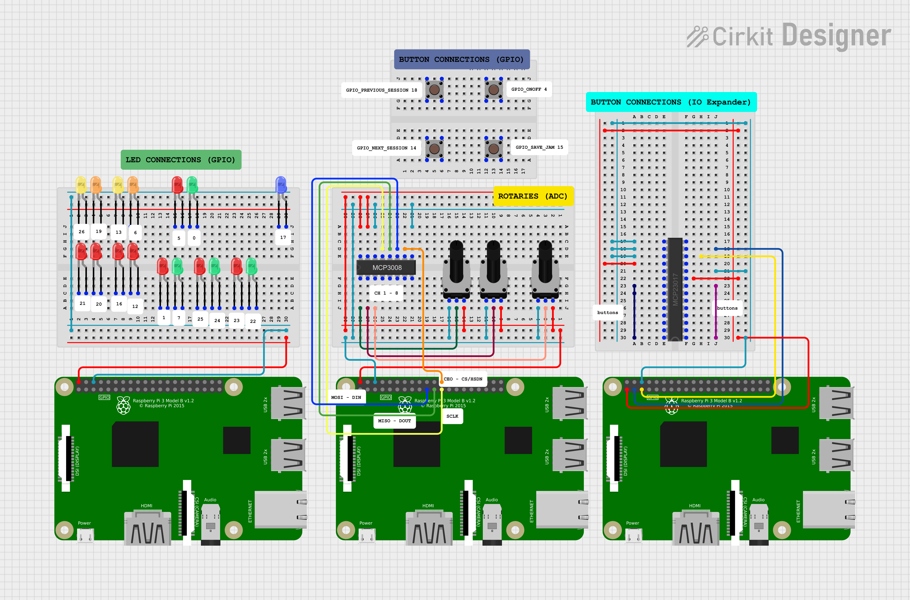

<h1 align="center">Setup PiLoop in RPI Mode</h1>

  <a href="#raspberry-pi">Raspberry Pi</a> |
  <a href="#components-list">Components list</a> |
  <a href="#buttons">Buttons</a> |
  <a href="#potentiometers">Potentiometers</a> |
  <a href="#leds">LEDs</a> |
  <a href="#pinouts">Pinouts</a>

 |  
:-------------------------|-------------------------:
[link](files/info/imgs/rpi_vertical.png) | [link](files/info/imgs/rpi_real_wirring.png)

## Raspberry Pi

For the current PiLoop setup, a [Raspberry Pi 3 Model B+](https://www.raspberrypi.com/products/raspberry-pi-3-model-b/) has been used.

### OS

PiLoop runs on Linux server. No desktop environment is required. It is tested on various debian distros (i.e. [diet-pi](https://dietpi.com/#download), [Debian server](https://raspi.debian.net/) etc).

## Components list

To integrate the hardware components to the GPIO pins of the raspberry the following components were used:

* 2 Breadboards
* an MCP23017 IO expander ([datasheet](https://ww1.microchip.com/downloads/en/devicedoc/20001952c.pdf))
* an MCP3008 A/DC converter ([datasheet](https://ww1.microchip.com/downloads/aemDocuments/documents/MSLD/ProductDocuments/DataSheets/MCP3004-MCP3008-Data-Sheet-DS20001295.pdf))
* 2-pin buttons
* 3-pin rotary potentiometers
* LEDs
* pull-up resistors
* wires

## Buttons

Apart from the buttons listed below, all other buttons are connected through the IO Expander to the Raspberry Pi:
- ONOFF
- PREV_SESSION
- NEXT_SESSION
- SAVE_JAM

For more details, see the [MCP23017 connections](#MCP23017-IO-expander) below.

**IMPORTANT** : The IO expander uses the I2C protocol. You **must** enable the `i2c interface` on your machine and install `i2c-tools`.

## Potentiometers

Potentiometers are connected to the analog-to-digital circuit of MCP3008. For a detailed overview of the connections, see the [MCP3008 connections](#MCP3008-AD-converter) below.

## LEDs

LEDs are all connected directly to the [GPIO pins](#raspberry-pi-3-gPIO-pins) of the Raspberry Pi.

## Pinouts

#### Raspberry Pi 3 GPIO Pins

<table>
<tr><th>Left side </th><th>Right side</th></tr>
<tr><td>

| Connection | GPIO | Physical Pin |
|--|:--:|:--:|
| 3v3 | - | 1 | 
| **MCP23017_SDA** | 2 | 3 |
| **MCP23017_SCL** | 3 | 5 | 
| **ONOFF** | 4 | 7 |
| GND | - | 9 | 
| **LED 16 - SAVE_JAM** | 17 | 11 |
|  | 27 | 13 | 
| **LED 15 - CH3_G** | 22 | 15 |
| 3v3 | - | 17 | 
| **MCP3008_DIN** | 10 | 19 |
| **MCP3008_DOUT** | 9 | 21 | 
| **MCP3008_CLK** | 11 | 23 |
| GND | - | 25 | 
| **LED 9 - METRO_G** | 0 | 27 |
| **LED 8 - METRO_R** | 5 | 29 | 
| **LED 3 - IN2_EFF2** | 6 | 31 |
| **LED 2 - IN2_EFF1** | 13 | 33 | 
| **LED 1 - IN1_EFF2** | 19 | 35 |
| **LED 0 - IN1_EFF1** | 26 | 37 | 
| GND | - | 39 |

</td><td>

| Physical Pin | GPIO | Connection |
|:--:|:--:|--:|
| 2 | - | 5v |
| 4 | - | 5v |
| 6 | - | GND |
| 8 | 14 | **NEXT_SESSION** |
| 10 | 15 | **SAVE_JAM** |
| 12 | 18 | **PREV_SESSION** |
| 14 | - | GND |
| 16 | 23 | **LED 14 - CH3_R** |
| 18 | 24 | **LED 13 - CH2_G** |
| 20 | - | GND |
| 22 | 25 | **LED 12 - CH2_R** |
| 24 | 8 | **MCP3008_CS/SHDN** |
| 26 | 7 | **LED 11 - CH1_G** |
| 28 | 1 | **LED 10 - CH1_R** |
| 30 | - | GND |
| 32 | 12 | **LED 7 - IN2_MNTR** |
| 34 | - | GND |
| 36 | 16 | **LED 6 - IN2_ARM** |
| 38 | 20 | **LED 5 - IN1_MNTR** |
| 40 | 21 | **LED 4 - IN1_ARM** |

</td></tr> </table>

##### (reference : [pinout.xyz/](https://pinout.xyz/))

#### MCP23017 IO expander 

<table>
<tr><th> Left side </th><th> Right side </th></tr>
<tr><td>

| Connection | Pin Name | Physical Pin |
|:--|:--:|:--:|
| **TAP_TEMPO** | GPB0 | 1 | 
| **START_STOP_ALL** | GPB1 | 2 | 
| **CH1_REC** | GPB2 | 3 |
| **CH1_STOP** | GPB3 | 4 |
| **CH2_REC** | GPB4 | 5 | 
| **CH2_STOP** | GPB5 | 6 | 
| **CH3_REC** | GPB6 | 7 |
| **CH3_STOP** | GPB7 | 8 |
| 3v3 | VDD | 9 | 
| GND | VSS | 10 | 
| - | NC | 11 |
| GPIO3 | SCK | 12 |
| GPIO2 | SDA | 13 | 
| - | NC | 14 | 
</td><td>

| Physical Pin | Pin Name | Connection |
|:--:|:--:|--:|
| 28 | GPA7 | **IN1_EFF1** | 
| 27 | GPA6 | **IN1_EFF2** | 
| 26 | GPA5 | **IN2_EFF1** |
| 25 | GPA4 | **IN2_EFF2** |
| 24 | GPA3 | **IN1_ARM** | 
| 23 | GPA2 | **IN1_MNTR** | 
| 22 | GPA1 | **IN2_ARM** |
| 21 | GPA0 | **IN2_MNTR** |
| 20 | INTA | - | 
| 19 | INTB | - | 
| 18 | RESET | 3v3 |
| 17 | A2 | GND |
| 16 | A1 | GND | 
| 15 | A0 | GND | 

</td></tr> </table>

##### ([*MCP23017 datasheet*](https://ww1.microchip.com/downloads/en/devicedoc/20001952c.pdf))

#### MCP3008 AD converter

<table>
<tr><th>Left side </th><th>Right side</th></tr>
<tr><td>

| Connection | Pin Name | Physical Pin |
|:--|:--:|:--:|
| POT_CH1 | CH0 | 1 | 
| POT_CH2 | CH1 | 2 | 
| POT_CH3 | CH2 | 3 |
| - | CH3 | 4 |
| - | CH4 | 5 | 
| - | CH5 | 6 | 
| - | CH6 | 7 |
| - | CH7 | 8 |
</td><td>

| Physical Pin | Pin Name | Connection |
|:--:|:--:|--:|
| 16 | VDD | 5v | 
| 15 | VREF | 5v | 
| 14 | AGND | GND |
| 13 | SCLK | GPIO11 |
| 12 | DOUT | GPIO9 | 
| 11 | DIN | GPIO10 | 
| 10 | CS/SHDN | GPIO8 |
| 9 | DGND | GND |
</td></tr> </table>

##### *([MCP3008 datasheet](https://ww1.microchip.com/downloads/aemDocuments/documents/MSLD/ProductDocuments/DataSheets/MCP3004-MCP3008-Data-Sheet-DS20001295.pdf))*
